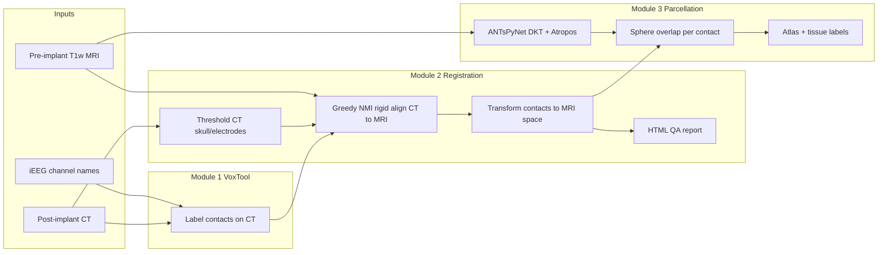

# Scientific Theory of the iEEG-recon Pipeline

**Reference:** Lucas A, et al. *Epilepsia*. 2024;65:817–829. DOI: [10.1111/epi.17863](https://doi.org/10.1111/epi.17863)

---

## 1. The Clinical and Scientific Problem

Drug-resistant epilepsy affects a substantial fraction of patients with focal seizures. When scalp EEG and noninvasive imaging are insufficient, clinicians implant **intracranial electrodes** to record directly from brain tissue at millimeter scale. Two dominant implant types are used:

- **SEEG (stereo-EEG / depth electrodes):** thin shafts inserted along planned trajectories through cortex and subcortex.
- **ECoG (subdural grids and strips):** surface arrays placed beneath the skull over cortex.

The **electrophysiological signal** from each contact is only interpretable in anatomical context: knowing *where* a contact sits relative to hippocampus, temporal neocortex, insula, or resection margin determines whether that channel supports seizure onset, propagation, or eloquent function.

After implantation, the surgical team must answer:

1. **Where is each contact in the patient's brain?**
2. **Which anatomical region or tissue class does each contact sample?**
3. **Do implanted devices (e.g., RNS generators) and leads align with preoperative plans?**

This process is **electrode reconstruction** (also called localization or coregistration). It bridges **post-implant CT** (where metal contacts are visible) and **pre-implant MRI** (where soft-tissue anatomy is visible), then maps contacts into **standard atlases** for group analysis and clinical reporting.

iEEG-recon formalizes reconstruction as three sequential transformations of information:

```
Post-implant CT  →  [Module 1]  →  labeled contacts in CT space
                              ↓
                    [Module 2]  →  contacts in native MRI space
                              ↓
                    [Module 3]  →  tissue + parcellation labels per contact
```

---

## 2. Why Two Imaging Modalities Are Required

### Post-implant CT

Computed tomography uses X-ray attenuation. Metal electrode contacts and the skull produce **very high Hounsfield units (HU)**. Contacts appear as bright point-like or rod-like structures. CT is therefore the **ground-truth modality for contact geometry** immediately after surgery.

Limitations of CT alone:

- Poor soft-tissue contrast (gray vs. white matter barely distinguishable).
- No reliable link to cortical parcellations used in research (Desikan–Killiany, Schaefer, AAL).
- Does not match the high-resolution T1w MRI acquired preoperatively for surgical planning.

### Pre-implant MRI

T1-weighted MRI provides **excellent anatomical contrast** and is the standard basis for:

- Neuronavigation during implant planning.
- FreeSurfer / ANTsPyNet cortical parcellation.
- Comparison with fMRI, DTI, and group templates (MNI space).

Limitations of MRI alone:

- Electrodes may not be visible or may appear with different contrast than on CT.
- Post-implant brain geometry can differ slightly from pre-implant scans (brain shift for surface grids, edema, resection cavities in repeat surgeries).

### The Core Scientific Task

Reconstruction estimates a **spatial correspondence** between CT and MRI such that each labeled contact in CT can be assigned **anatomically meaningful coordinates** in the MRI coordinate system—and, by extension, in atlases registered to that MRI.

Mathematically, Module 2 seeks a rigid transform **T** mapping CT coordinates **x_CT** to MRI coordinates **x_MRI**:

```
x_MRI = T(x_CT) = R · x_CT + t
```

where **R** is a 3×3 rotation matrix and **t** is a translation vector (6 degrees of freedom, rigid body assumption). Non-rigid brain deformation is handled separately (optional brain-shift correction for ECoG).

---

## 3. Coordinate Spaces and Data Organization

The pipeline uses a **BIDS-like hierarchy** so that sessions, modalities, and derivative outputs remain traceable:

| Space code | Meaning |
|---|---|
| `T01ct` | Native post-implant CT voxel space |
| `T00mri` | Native pre-implant reference T1w MRI space |
| MNI152 (optional) | Standard template space for group studies |

A subject may have:

- **Clinical session:** post-implant CT + VoxTool labels (`ses-clinical01`).
- **Research session:** high-resolution pre-implant T1w (`ses-research3T`).

Module 2 registers CT to the **reference MRI session** chosen by the user. All downstream anatomy is expressed in that MRI's native geometry unless optional MNI export is requested.

---

## 4. Module 1 — Semiautomatic Electrode Labeling (VoxTool)

### Scientific role

Module 1 establishes **discrete point observations** of contact centroids in CT voxel space, each with a **unique identifier** (e.g., `LA8` = left array, contact 8). Without these labels, bright voxels on CT cannot be assigned to specific recording channels in the iEEG file.

### Theoretical basis

1. **Intensity thresholding:** Metal contacts exceed tissue HU by orders of magnitude. Thresholding isolates candidate contact voxels from bone and soft tissue.
2. **Human-in-the-loop localization:** Fully automatic detection remains error-prone for grids, bent shafts, artifact from RNS hardware, and partial contact visibility. Expert clicking encodes domain knowledge.
3. **Geometric interpolation:** Grids, strips, and linear depth shafts are **low-dimensional manifolds** in 3D. Once endpoints or seed contacts are placed, linear or grid interpolation estimates remaining contacts under assumptions of regular spacing—reducing manual burden.

### Output

A text file of labeled CT coordinates (`desc-vox_electrodes.txt`) is the **input observational dataset** for all subsequent modules. Errors here propagate directly to anatomical conclusions; Module 2's QA report is designed to catch gross mislabeling.

### What Module 1 does *not* do

It does not perform registration, parcellation, or tissue classification. It answers only: *"Which named channel corresponds to which point in CT space?"*

---

## 5. Module 2 — CT-to-MRI Registration

### Scientific role

Module 2 applies the rigid transform **T** to every labeled contact so that electrophysiology can be interpreted against **MRI-visible anatomy** (cortex, ventricles, hippocampus, resection cavities on later scans).

### Preprocessing: CT skull / electrode isolation

Before registration, the CT is **thresholded** so that primarily **skull and electrodes** remain visible. Rationale:

- Mutual information registration between full CT and MRI is dominated by **shared skull geometry**, which is approximately rigid between scans.
- Electrode bright spots provide additional fiducial-like constraints along the skull interior.
- Suppressing soft-tissue CT signal reduces misleading matches from postoperative changes.

### Registration algorithms

**Greedy (recommended):** A multiresolution optimizer maximizing **normalized mutual information (NMI)** between CT and MRI intensity distributions. NMI is well suited to **multimodal** alignment because it does not assume linear intensity relationship between modalities—only statistical dependence.

**FLIRT (fallback):** FSL's linear registration with mutual information cost and histogram binning. Used when Greedy fails or for comparison.

Both estimate **6-DOF rigid** transforms. Affine or nonlinear warps are not the default because the primary goal is global head-frame alignment; local brain shift for ECoG is a separate optional step.

### Transform application to contacts

Each VoxTool point **p** in CT indices/mm is transformed:

```
p_MRI = T_CT→MRI(p_CT)
```

The pipeline also generates:

- **Thresholded CT in MRI space** — visual overlay for QA.
- **Electrode sphere maps** — small binary volumes around each contact for visualization.
- **HTML report + ITK-SNAP workspace** — human verification that CT skull and electrodes align with MRI anatomy.

### Quality assurance as part of the scientific method

The paper validates reconstruction with **board-certified neuroradiologist review** of these overlays—not blind trust in the optimizer. Misregistration of even 2–3 mm can misassign contacts across gyri or gray/white boundaries, directly affecting SOZ interpretation.

---

## 6. Module 3 — Anatomical and Tissue Assignment

### Scientific role

Once contacts exist in MRI space, Module 3 answers: **what brain structure does each contact sample?** This enables:

- Clinical mapping (e.g., "seizure onset channel sits in left hippocampus").
- Research group analyses (common atlas labels across subjects).
- Tissue-aware statistics (gray matter vs. white matter vs. CSF sampling).

### Step A — Brain segmentation (ANTsPyNet)

Traditional FreeSurfer `recon-all` parcellation is accurate but slow (~5 hours). iEEG-recon defaults to **ANTsPyNet**, a deep learning framework built on ANTs and TensorFlow that predicts:

- **DKT cortical parcellation** (Desikan–Killiany–Tourville labels).
- **Atropos tissue classes** (CSF, gray matter, white matter, deep gray, etc.).

Scientific justification: Convolutional networks trained on large neuroimaging cohorts approximate the nonlinear mapping from T1w intensity patterns to tissue class **without** explicit generative models. Lucas et al. report **Pearson r = 0.96** agreement with FreeSurfer for electrode region assignments, with ~30× speedup—making same-day clinical review feasible.

### Step B — Sphere-based ROI assignment

For each contact at position **c** in MRI mm space, the pipeline constructs a sphere **S(c, r)** of user-specified radius **r** (commonly 2 mm). Each atlas label **L** receives a score:

```
overlap(L) = |S(c, r) ∩ region_L| / |S(c, r)|
```

The label with **maximum overlap** is the primary assignment. The pipeline also exports **ranked partial overlaps** for all contacted regions—important because:

- A 2 mm sphere may span gray/white boundary or sulcal CSF.
- Depth electrodes may sit in white matter while nominally targeting a cortical gyrus; secondary overlaps carry scientific meaning.

### Atlas options

| Atlas type | Use case |
|---|---|
| DKT (ANTsPyNet) | Lobar / gyral labels (clinical & research standard) |
| Atropos tissues | WM / GM / CSF fractions (matches paper tissue statistics) |
| MNI atlases (AAL, Schaefer, …) | Group templates, functional network labels |
| ASHS, THOMAS | Hippocampal and thalamic subfields |

Optional **MNI registration** (antsRegistration, fMRIPrep-compatible) warps native MRI parcellations to **MNI152** for multicenter aggregation.

### Interpretation caveats

- **Cortical atlases under-label white-matter contacts:** Depth SEEG shafts often show `EmptyLabel` as primary DKT assignment while Atropos correctly reports white matter—this is expected geometry, not pipeline failure.
- **Radius choice affects labels:** Smaller **r** → more localized; larger **r** → more mixed partial volumes.
- **Parcellation is probabilistic at the voxel level:** Sphere voting is a pragmatic deterministic summary, not a biophysical model of actual sampling volume of each contact.

---

## 7. Optional Extensions

### Brain-shift correction (ECoG)

After craniotomy, subdural grids can **sink inward** relative to preoperative MRI.pial surface. A optional nonlinear energy-minimization step reposition surface contacts onto the pial mesh while preserving inter-contact distances, using FreeSurfer surface geometry. Applies to grids/strips, not depth shafts.

### Post-surgical MRI module

When tissue is resected, a post-op MRI shows a cavity. Registering post-op → pre-op MRI identifies which **pre-implant contact locations** would have fallen inside the resection—critical for correlating SOZ channels with surgical outcome.

### Defacing and cloud deployment

For multicenter studies, MRI/CT defacing removes facial features before upload. Docker containers ensure identical software versions across sites—controlling a major source of reproducibility variance in neuroimaging pipelines.

---

## 8. End-to-End Information Flow



---

## 9. What "Accuracy" Means in the Paper

The Epilepsia validation is **clinical and geometric**, not a voxel-perfect ground truth for every contact:

1. **Neuroradiologist approval** of CT–MRI overlays and contact positions.
2. **Cohort-level tissue statistics** (WM/GM/CSF proportions at 2 mm) consistent with expected SEEG/ECoG sampling.
3. **Spatial bias** toward temporal lobe in a temporal epilepsy cohort.
4. **Robustness** across RNS hardware artifact and prior resections.
5. **Concordance** ANTsPyNet vs. FreeSurfer parcellation labels (r = 0.96).

The pipeline does **not** claim sub-millimeter ground truth against invasive stereotactic frames in all cases; it claims a **practical, fast, reproducible workflow** that experts judge acceptable for clinical conference and research.

---

## 10. Summary Table

| Stage | Question answered | Key method | Output |
|---|---|---|---|
| Module 1 | Which channel is which point on CT? | Threshold + manual VoxTool + interpolation | `desc-vox_electrodes.txt` |
| Module 2 | Where is that point in MRI space? | Rigid CT↔MRI registration (Greedy NMI) | mm coords, QA HTML, transforms |
| Module 3 | What anatomy does it sample? | ANTsPyNet segmentation + sphere voting | DKT, tissue, optional MNI labels |

Together, these stages implement the standard neurosurgical reasoning chain—**visible contacts on CT → patient anatomy on MRI → named brain regions**—in a containerized, auditable, and scalable form suitable for modern epilepsy centers and multicenter research.

---

## References

1. Lucas A, Scheid BH, Pattnaik AR, et al. iEEG-recon: A fast and scalable pipeline for accurate reconstruction of intracranial electrodes and implantable devices. *Epilepsia*. 2024;65:817–829.
2. iEEG-recon documentation: https://ieeg-recon.readthedocs.io
3. ANTsPyNet: https://github.com/ANTsX/ANTsPyNet
4. VoxTool: https://github.com/penn-cnt/voxTool
